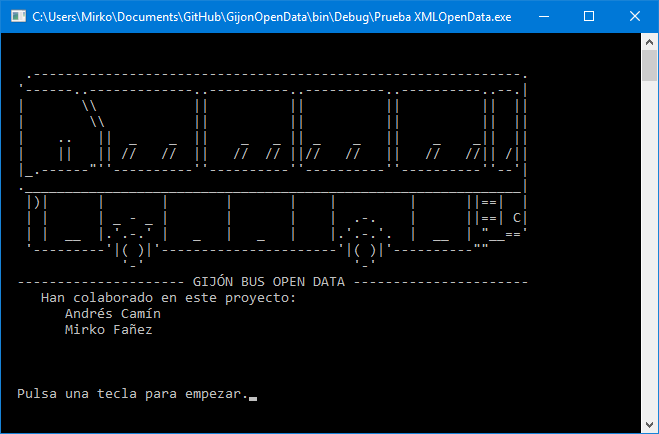
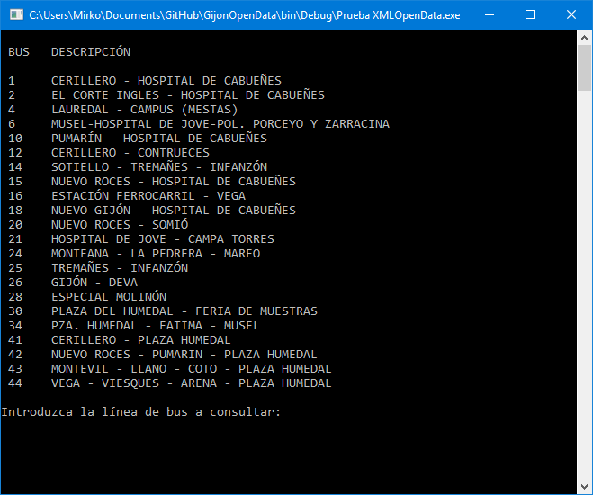
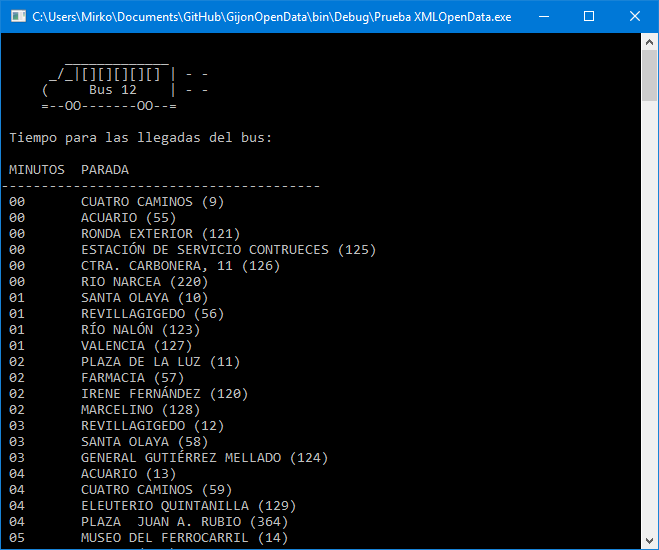

# GijonOpenData

Usando los datos abiertos proporcionados por el ayuntamiento de **Gijón**, hemos creado una aplicación de consola para obtener la información de los autobuses de la ciudad.

Seleccionando un número de línea se obtiene el tiempo que falta para llegar a las paradas.

Open data: [https://transparencia.gijon.es](https://transparencia.gijon.es)

**Desarrolladores**:

- Andrés Camín Fernández
- Mirko Fañez Kertelj (Ver [http://www.mirkoo.es](http://www.mirkoo.es))

## Capturas ##

